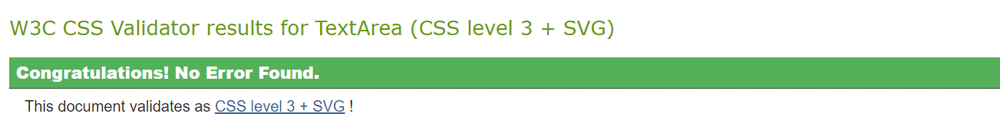

# Disney Villains

This website is somewhere for people, like me, who enjoy the bad guys of the Disney world. This website allows the user to learn more about the characters who are out to stop the good guys. This project is the basis of what can become something much larger, with more characters being added as the Disney franchise grows. 

The first page is an introduction for users of the site, it includes a timeline of all the villains mentioned in the later pages and those who are featured in the header image. There are three main pages focused on the villains themselves, one for each gender of villain, with an image of each and a brief descriptiom of who they are and which movie they are from etc. The third page contains a more detailed description of the characters and a more in depth look at the movie they are featured in as the villain. The final page of the website is for the user to have their say and request another villain to be added to the website. 

The goal of this website is for users who are a fan of the Disney franchise (villains in particular) to be able to see the characters that they love, all in one place and can read up about them and see where they fall in the Disney movie timeline and find out what makes that character unique.

## Business Goals

* Gathering place for Disney villain fans
* Increase the villains fan base
* Introduce users to the villains and educate them about their history

## Customer Goals

* Easy to navigate website structure
* Quick and simple descriptions
* Visually appealing
* Social media links and a link to a wiki page that houses everything Disney 

# UX

## Strategy

Following the core UX principles, I firstly decided on my target audience and decided what I would want to see if I was interested in this particular topic.

### Disney Villain Target Audience:

* Users of all ages
* Disney fans
* Those with a love for the villains of the Disney world

### What the users would want from the website:

* Informal language
* Ease of navigation between pages
* Responsive so the website is viewable on multiple platforms
* Visually appealing and contains relevant information about the topic

### The website is best for users:

Most websites that are similar to this one, feature the good guys in addition to the villains which can sometimes over-shadow the villain of the movie. Many people who share the interest in the Disney villain franchise would need to scour through huge websites, eventually finding the information/characters they were looking for after spending an excessive amount of time scrolling through pages and pages. This website identifies this gap in the market and provides the individual with this information all in one place.

## Scope

To achieve the goals I set out for this website, I included the following features:

* Header with page logo
* Large image to show which villains will be featured
* Easy to use navigation menu
* Separate pages for male and female villains
* Combined biography page for all villains featured throughout the website
* Borders around the information to make it stand out
* Footer to contain a subscribe feature and the links to various social media platforms

## Structure

I used descriptive file names so that it defined what information the relevant page contained. Due to the amount of information I wanted to include on the website, including descriptions and images, one page was too restrictive and therefore I created five pages in total. The menu is a consistent format and layout throughout the website, the names of each page are easy to follow and when a page is being viewed, the relevant menu link is highlighted purple. 

The main page is simple and contains a brief overview of the site, including a timeline of the featured villains and their corresponding movies. An embedded video is shown underneath the timeline, this is a medley of songs that are sang by the villains in their movies. The page then finishes with the footer at the bottom of the page.

Both the male and female villain pages use the same structure. I structured these pages to ensure the information did not look cramp on the page, the added images were used primarily as a visual aid, but they also link to the biographies page so when you click a villain portrait, you are taken to the corresponding biography.

## Skeleton

I created quick sketches of what I wanted the website to look like in Excel as it was easy to define the space and the frame of the site in its basic form.

## Surface

The colour scheme of the website was chosen to provide simplicity and to match the colours that similar websites use for the Disney villains. The logo colour was chosen as it stood out on the grey background and is a colour that features on some of the characters. The grey background was chosen as it is a solid basic colour that made th purple colour stand out and the images stand out against it.

I chose the font 'Cinzel Decorative' throughout as it looks appealing for the website and was very suited to the theme of the website. This font by default uses all uppercase which means the user is able to clearly read the text and follow the site structure. Furthermore, 'Sans-serif' was used as the default go to in case my chosen font couldn't be loaded. I used a hover effect on the navigation bar to attract attention and demonstrate the ease of navigation across all pages.

# Features

## Navigation Bar

All five pages have a fully functioning navigation bar which includes links to the Home, Female Villains, Male Villains, Villain Bios and Request a villain pages, these are identical on each page to keep the website consistent. This allows the user to navigate to whichever page they require. Also, the main logo is a link to the home page so clicking this will revert the user back to the home page.

## Villain Outlines

The villain outline pages were done as a first port of call for the user to see the villains and find out the basics about each character. Subsequently, each image is also a link to their name on a further page that gives a more in depth look at each villain and what they're about. 

## Villain Biographies

The villain bio page provides a more in depth look at the villains. It details the movie and the basic plot as well as giving a bit more of a background for the character which the previous website pages don't provide.

## Request a Villain

The Request a Villain page give the user a chance to request a villain that is currently missing from the site. As the site is in early stages there are many more villains out there to be added so giving people the chance to be a part of that process is one way to encourage return site users.

## Footer

The footer houses social media links to a Facebook page dedicated to Disney Villains, an Instagram page for Disney VIllains and the wiki page for all things Disney. I have also included an option for the user to sign up to a newsletter so they would get an email when a new villain is added.

## Features left to implement

* A News page that details the upcoming additions to the site and also updates about new movies and the villain(s) within it.
* A forum for users to discuss Disney topics
* A space for users to create and share their own fan-fiction

## Technologies used

[HTML](https://developer.mozilla.org/en-US/docs/Web/HTML)

* HTML was used as the main building block for content structure.

[CSS](https://developer.mozilla.org/en-US/docs/Web/CSS)

* CSS was used to set the layout of the site and the features within it and to make the website responsive for multiple screen sizes.

[Google Developer Tools](https://developer.chrome.com/docs/devtools/)

* Google Dev Tools were used so i could check my website through all stages of development and ensure it was responsive.

[Google Fonts](https://fonts.google.com/)

* Google fonts is where i chose the font that is seen throughout the website.

[Google Images](https://images.google.co.uk/)

* Google images is where i found the main header iimage for the website.

[Disney Wiki](https://disney.fandom.com/wiki/The_Disney_Wiki)

* The disney wiki page is where i got the majority of my imags and thumbnails from.

[Font Awesome](https://fontawesome.com/)

* Font Awesome is where i got the Facebook, Instagram and Wiki icons from.

[github](https://github.com/)

*  Github was used to store the code for the project.

[Git](https://git-scm.com/)

* Git wasused for version control to commit and push to Github.

[Gitpod](https://www.gitpod.io/)

* Gitpod was used as the development environment.

[WebAim](https://webaim.org/resources/contrastchecker/)

* Used this website to check to contrast of colours for the background colour and text colour

[W3C Markup Validation Service](https://validator.w3.org/)

* This was used to test my code and to make sure there were no errors 

[W3C CSS Validation Service](https://jigsaw.w3.org/css-validator/)

* This was used to test my code and to make sure there were no errors or redundant code that didn't need to be there

[Am I Responsive](https://ui.dev/amiresponsive)

* Used this to demonstrate what my website would look across different devices

# Testing

## User Stories

1. As a first time user, I want to easily locate my favourite villain.
* There are 2 clearly marked pages of villains, male and female once you are on the appropriate page then you can click the icon of your chosen character and be taken to a more in depth look at that villain.

2. As a first time/ returning user, I want clearly laid out information
* All the information is laid out in organised sections and there is clear definition between each individual villain in their respective page.

## Testing

I tested my website on a few platforms including Microsoft Edge, Chrome and Android web. I confirmed my project is responsive by using the dev tools on the web browsers and changing the sizes of the screen. I have tested the links to make sure they go to the correct external and internal pages. The villain request form has a submit button and this opens in a new window.

## Validator Testing

### HTML
* All five of my web pages were tested using the official W3C Validator and they passed without error.

### CSS
* When I ran my CSS through the validator it passed without error

### Accessibility
* I can confirm the colours and font I chose are easy to read and accessible when running lighthouse in Dev tools

## Deployment

I followed these steps to deploy mywebsite:
* Log into Github
* Selected the Disney-Villains repository
* Click the settings button
* select 'pages' on the left hand side
* In the sources section, select branch 'main' and save
* After a few seconds the link to website was provided as seen below

# Credits

## Code
* General coding queries were answered by using [W3Schools](https://www.w3schools.com/html/)
* The code template I used for the timeline featured on the home page was also from [W3Schools](https://www.w3schools.com/html/)

## Content
* The icons used were from [Font Awesome](https://fontawesome.com/)

## Media
* The main image used for the website was found on [Google Images](https://images.google.co.uk/)
* The other images such as the small character images used on the male and female villains pages were from [Disney Wiki](https://disney.fandom.com/wiki/The_Disney_Wiki)

# Acknowledgements
I would like to thank my mentor Andre Aquilina for his support, helpful guidance and the ideas he had about certain features I had on the website and how to improve them. 